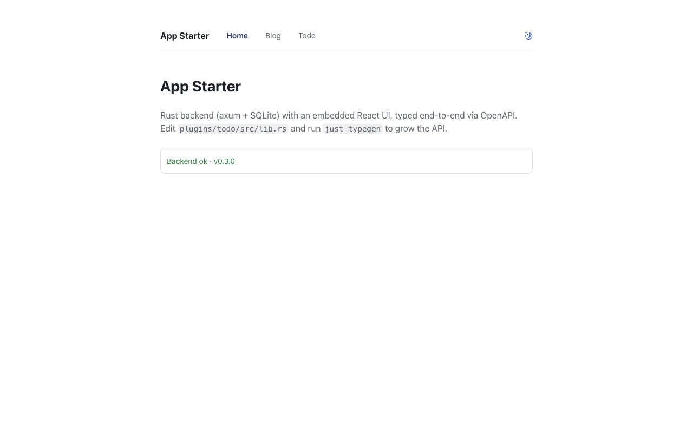
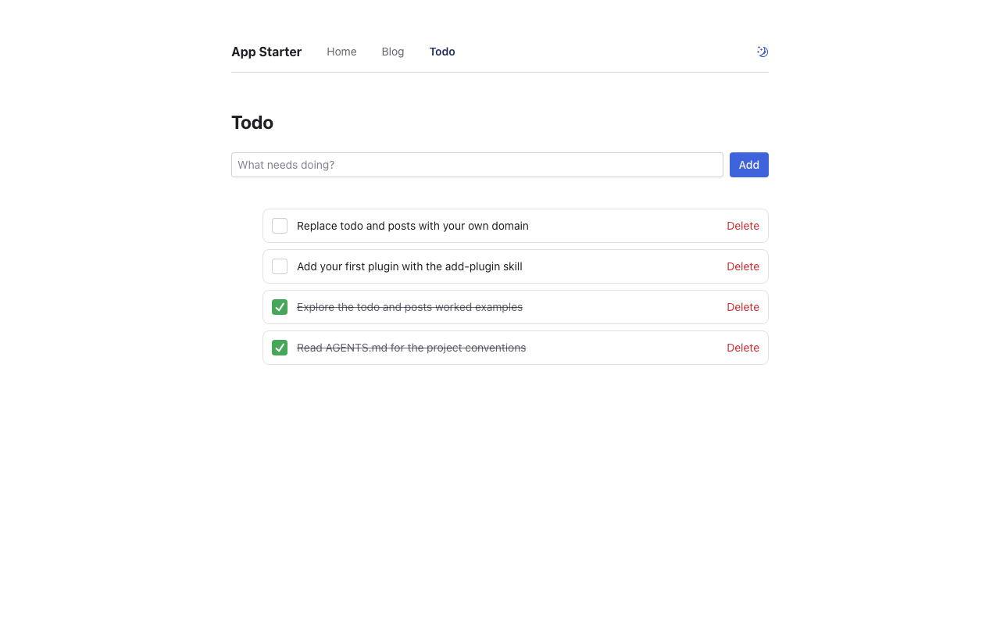
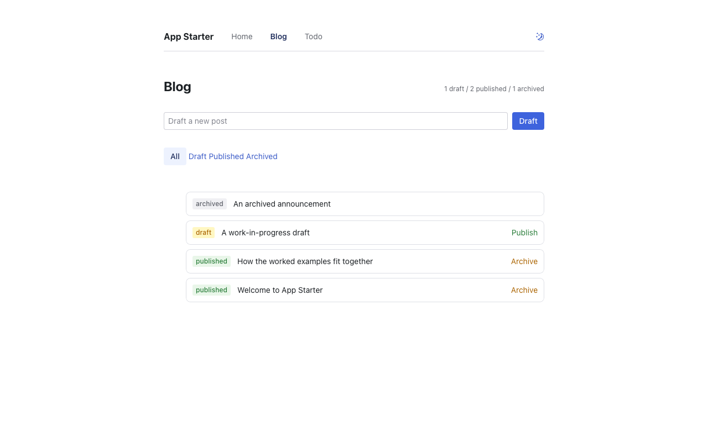

# App Starter

Full-stack Rust starter. One binary serves the API and the UI, typed end to end via OpenAPI.

**Who it's for:** technical builders and AI coding agents who want a fast, type-safe foundation for shipping real software. It assumes Rust, Bun, and a terminal. Making this accessible to non-technical builders (guided scaffolding, AI-driven generation) is a deliberate next-phase goal on the [Roadmap](#roadmap), not a v1 claim.

**Vision:** the long-horizon intent behind this template is in [VISION.md](VISION.md) — human-maintained; agents reference it but never edit it.

**Stack:** axum + SQLite (sqlx) on the backend. React 19 + Vite + Radix Themes + TanStack Router/Query on the frontend, embedded into the binary with rust-embed. Optional Tauri 2 desktop shell that bundles the server as a sidecar. Bun for JS tooling, just for tasks.

Two example resources ship as self-contained plugins, each wired through every layer (migration, queries, API handlers, generated TypeScript types, UI page, tests): `todo`, a minimal CRUD, and `blog`, which adds a status lifecycle (draft -> published -> archived), filtered queries with pagination, and an aggregate stats endpoint. Scaffold your own with `just new-plugin`, then replace them. The wiring pattern stays.

## See it running

Clone, build the UI, and seed example data so the Todo and Blog pages are populated — about a minute, start to finish:

```bash
git clone https://github.com/eibrahimov/app-starter && cd app-starter
cd interface && bun install && bun run build && cd ..
just seed   # seeds the example todo + blog plugins, then serves on :8080
```

Open http://localhost:8080 — the Todo and Blog pages already have data. Without `just`, the last step is `cargo run -- --seed`. (Starting your own project instead of evaluating the template? Use [Setup](#setup) below, which renames it.)

**Home** — the embedded UI shell, health-checked against the API and typed end to end via OpenAPI.



**Todo** — minimal CRUD: add, complete, and delete todos.



**Blog** — a draft -> published -> archived lifecycle with status badges, status filters, and a stats summary.



## Use this when

- You want one Rust server to own the API and serve the built UI.
- You want generated TypeScript types from the backend OpenAPI contract.
- You want SQLite and Docker to cover local development through small-team deployment.
- You prefer explicit files and examples over generators and hidden framework behavior.
- You may want a desktop shell later, but do not want desktop concerns to dominate the web/API core.

## Choose another path when

- You need built-in auth, tenancy, billing, or admin screens on day one.
- You need multiple database backends or a framework-neutral frontend choice.
- You want a Kubernetes/cloud-platform template more than a single-binary app foundation.
- You want a CRUD generator or no-code system instead of a small code template.

## Setup

Prerequisites: [Rust](https://rustup.rs), [Bun](https://bun.sh), and optionally [just](https://github.com/casey/just). Run `just doctor` (or `bash scripts/doctor.sh`) at any point to check your toolchain and build state — it prints a fix for anything missing.

```bash
# 1. Rename the project (one time, the script deletes itself)
./scripts/setup.sh "My Project"
# Windows (PowerShell): ./scripts/setup.ps1 "My Project"

# 2. Install frontend deps and build everything
cd interface && bun install && bun run build && cd ..
cargo run
```

Open http://localhost:8080 (or `$PORT` if you overrode it). The binary serves both the API and the built UI.

Copy `.env.example` to `.env` to override port, database path, or log level. To
point the frontend at a non-default API (a remote host, or a different backend
port), set `VITE_API_BASE_URL` in `interface/.env` (copy `interface/.env.example`)
— see [docs/api-endpoint.md](docs/api-endpoint.md) for the cross-surface base-URL
contract (server / SPA / desktop / CLI). Run `just hooks` once to enable the cargo
fmt pre-commit hook.

## Development loop

Two terminals:

```bash
cargo run             # backend on :8080
just frontend-dev     # Vite on :5173, /api proxied to the backend
```

Hot reload on the frontend, restart the backend on Rust changes.

### The typegen loop

This is the core workflow. The backend is the single source of truth for API types:

1. Add or change an endpoint — for a new resource, scaffold a plugin with `just new-plugin <name>` and annotate its handlers with `#[utoipa::path]`. The host builds the router and OpenAPI from the registered plugins, so you don't hand-edit a central `src/api.rs` (see [AGENTS.md](AGENTS.md))
2. Run `just typegen`
3. The frontend client (`interface/src/api/client.ts`) is now fully typed for the new endpoint. Wrong paths, params, or body shapes fail `tsc`.

Resource endpoints are versioned under `/api/v1/`, and the contract is additive within a version: add fields and endpoints freely, but a breaking change opens `/api/v2`. Health and the spec stay unversioned at `/api/health` and `/api/openapi.json`.

## Tasks

```bash
just dev            # run the backend
just frontend-dev   # run Vite with API proxy
just seed           # seed the example todo + blog plugins, then run the backend (see src/seed.rs)
just db-backup      # snapshot SQLite to a timestamped file in backups/ (safe online .backup)
just db-restore f   # restore from a backup file (guarded; FORCE=1 skips the prompt)
just db-check       # PRAGMA integrity_check + applied migrations (non-zero exit on failure)
just typegen        # regenerate TS types from the OpenAPI spec
just check-typegen  # fail if committed TS types are stale, same as CI
just lint           # fmt check + clippy -D warnings + Biome + tsc (fast gate)
just verify         # everything CI runs: lint + test + typegen + frontend build/test + cargo-deny
just test           # backend tests (in-memory SQLite)
just build          # production build: frontend, then binary with UI embedded
just docker-build   # build the Docker image
just screenshots    # regenerate the README screenshots (docs/assets/*.png)
```

If you don't have `just`, run the commands directly — see the [`justfile`](justfile) for the exact recipe behind each task.

For contribution gates and approval boundaries, see [`CONTRIBUTING.md`](CONTRIBUTING.md); for template direction and v1 priorities, see [`docs/template-direction.md`](docs/template-direction.md). Language-level conventions are in [`RUST_STYLE_GUIDE.md`](RUST_STYLE_GUIDE.md) and [`TS_STYLE_GUIDE.md`](TS_STYLE_GUIDE.md); the frontend component, section, and data-hook layer is documented in [`docs/components.md`](docs/components.md).

## Project layout

```text
plugin-api/        host<->plugin contract crate (Plugin trait, AppState, AppError)
src/
  main.rs          server entry (clap args, env via .env)
  lib.rs           crate root (re-exports the plugin-api contract)
  api.rs           HTTP layer: router + OpenAPI, built from the plugin registry
  api/health.rs    core health/readiness endpoint
  plugins/mod.rs   generated registry of compiled-in plugins (all())
  db.rs            pool init + core/plugin migrations
  seed.rs          optional example-data seeder (iterates plugins)
  frontend.rs      embedded SPA serving with index.html fallback
  bin/openapi_spec.rs  prints the spec for typegen
plugins/           one crate per resource (todo, blog): handlers, queries, migrations
interface/         React app (Vite, Radix Themes, TanStack)
  src/plugins/     per-plugin pages + build-time registry
  src/api/         generated schema.d.ts + typed fetch client
desktop/           Tauri 2 shell, server bundled as sidecar
tests/             black-box API tests (incl. plugin namespacing guards)
```

## Desktop app (optional)

The Tauri shell wraps the same UI and ships the server binary as a sidecar. The shell spawns it on launch and kills it on exit, in both dev and packaged builds, so a single command runs the whole app. Needs the [Tauri prerequisites](https://tauri.app/start/prerequisites/) for your platform.

```bash
just desktop-dev      # spawns the bundled backend automatically
just desktop-dev-hot  # backend hot-reloads via cargo-watch (needs `cargo install cargo-watch`)
just desktop-build    # bundles sidecar + frontend + installer
```

`just desktop-dev-hot` runs a live-reloading backend (cargo-watch) alongside the
shell, so both layers hot-reload: the UI via Vite and the backend on Rust
changes. It holds port 8080 first, so the shell's auto-spawned sidecar yields to
it. (Equivalently, run `cargo run` at the repo root before `just desktop-dev`.)

The shell ships a few safe-by-default behaviors (see
[docs/desktop-features.md](docs/desktop-features.md)): a **single-instance
guard** so a second launch focuses the running window instead of starting a
second backend that would race the SQLite file; **window size/position
persistence** across restarts; and a **sidecar log drain** that records the
bundled backend's stdout/stderr and exit code to a log file (see
[Troubleshooting](#troubleshooting)) so a failed startup is diagnosable rather
than a blank window.

Before shipping: replace the placeholder icon if needed with `cd desktop && bunx tauri icon src-tauri/icons/icon.png`, and change the bundle identifier in `desktop/src-tauri/tauri.conf.json` from `com.example.*` to your reverse domain.

## Database

SQLite via sqlx — a single file on disk (or `:memory:` in tests). It is a **single-writer** database: ideal for single-instance apps, internal tools, and desktop, but it does not support multiple server instances writing concurrently. For multi-instance or high-write deployments, swap sqlx to Postgres — that touches the pool type in `src/db.rs`, every `query`/`query_as`, and the migrations, so treat it as a fork, not a config flag. Migrations are forward-only and append-only: to fix a bad migration, add a new one; never edit a committed file (sqlx checksums them). Snapshot, restore, and integrity-check the database file with `just db-backup` / `just db-restore` / `just db-check` — see [docs/recipes/backup-restore.md](docs/recipes/backup-restore.md).

## Troubleshooting

- **`bun: command not found`** during build: install [Bun](https://bun.sh), then `cd interface && bun install`.
- **Port 8080 already in use:** run `PORT=8081 cargo run`, or stop the other process.
- **`frontend not built` page:** run `cd interface && bun install && bun run build`, then `cargo run`.
- **`just doctor` flags interface deps "declared but not installed" or `bun.lock` "out of sync":** your `interface/node_modules` is stale or incomplete (a dependency in `package.json`/`bun.lock` was never installed) — the dev server fails to resolve it only at runtime. Run `cd interface && bun install`.
- **`tsc` errors after changing an endpoint:** run `just typegen` and commit `interface/src/api/schema.d.ts` — it is generated, never hand-edited.
- **`database is locked`:** another process holds the SQLite file; stop it, or point `DATABASE_URL` at a different path.
- **`migration … was previously applied but is missing in the resolved migrations`:** your local SQLite file recorded a migration that no longer exists in `migrations/` (e.g. you ran a branch that was later reverted). The local DB is gitignored scratch data: delete it (`rm data/app.db`) and restart — the app recreates it from the current migrations. Back it up first if it holds data you need.
- **Desktop app shows a blank or broken window:** the bundled backend (sidecar) failed to start. The shell drains the sidecar's stdout/stderr and exit code to `app-starter-desktop.log` in the OS log directory for the app's bundle id (macOS: `~/Library/Logs/com.example.app-starter/`); open it for the bind failure, migration error, or panic that aborted startup.

## Deploy

`Dockerfile` builds a multi-stage image: bun for the frontend, cargo for the binary, slim Debian runtime. SQLite lives on a volume at `/data`.

```bash
docker compose up --build
```

Works as-is on Coolify or any Docker host: point it at the repo, the Dockerfile does the rest. Pushing a `v*` tag publishes a multi-arch image to GHCR and attaches prebuilt Linux/macOS/Windows binaries to the GitHub Release via `.github/workflows/release.yml`.

Note: CORS is permissive so the Tauri shell can reach the sidecar. Tighten `CorsLayer` in `src/api.rs` before exposing the API publicly without the embedded UI.

## Roadmap

v1 ships and supports today: **Web** (embedded SPA), **Docker** (multi-arch image to GHCR on `v*` tags), **Desktop** (macOS/Windows/Linux installers built locally via `just desktop-build`), **prebuilt binaries** (Linux/macOS/Windows) attached to the GitHub Release on each `v*` tag, and a **Vitest** frontend test harness with non-blocking coverage reporting.

Planned, explicitly post-v1 (tracked as issues — contributions welcome):

- **Signed desktop installers** in CI (macOS notarization, Windows code-signing) — requires developer certificates.
- **Mobile (iOS/Android)** via Tauri 2 — icons are present, but build/signing/store wiring is not. Do not assume `tauri build ios`/`android` works yet.
- **Accessibility for non-technical builders** — guided scaffolding and AI-assisted generation.

## License

MIT
